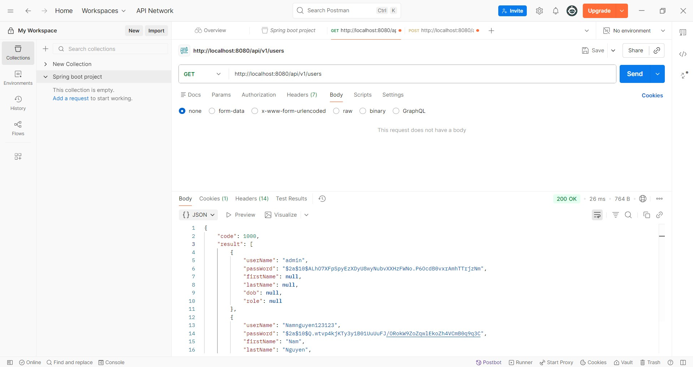
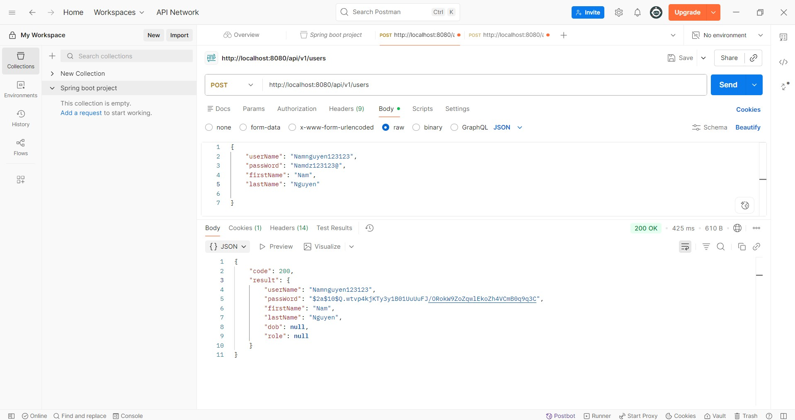
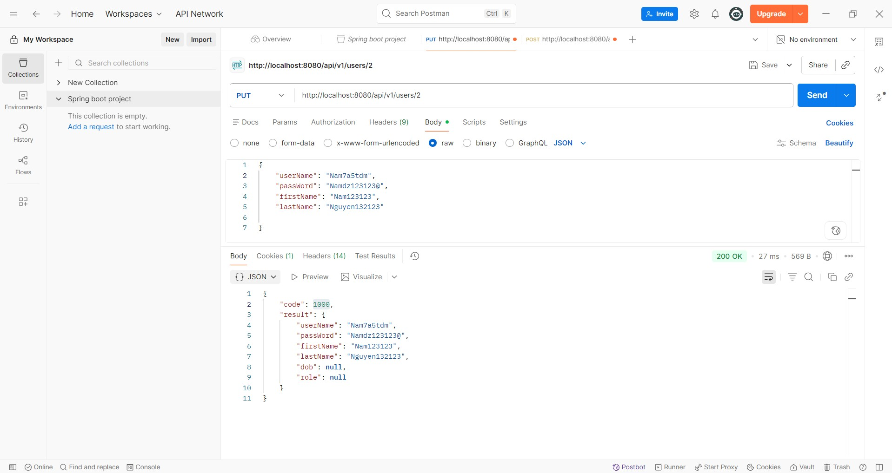
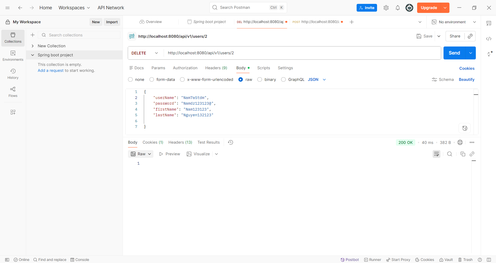

# 🚀 Spring Boot User Management & Authentication API

> Dự án Java Spring Boot RESTful API chuẩn mực, cung cấp đầy đủ các chức năng quản lý người dùng (User Management) và xác thực phân quyền bảo mật (Authentication & Authorization) sử dụng JWT (JSON Web Token), Spring Security, và Spring Data JPA.

---

## 🛠 Tech Stack

| Công nghệ | Chi tiết |
| :--- | :--- |
| **Language** | Java 17+ |
| **Framework** | Spring Boot 3.x |
| **Security & Auth** | Spring Security, Nimbus JWT |
| **Database Access** | Spring Data JPA / Hibernate |
| **Database** | MySQL |
| **Mapping & Utilities** | MapStruct, Lombok |
| **Build Tool** | Maven (`mvnw` wrapper included) |

---

## 🚀 Hướng Dẫn Cài Đặt & Chạy Ứng Dụng

### 1. Yêu cầu hệ thống (Prerequisites)
Trước khi bắt đầu, hãy đảm bảo máy tính của bạn đã cài đặt sẵn các công cụ sau:
- **Java Development Kit (JDK):** Phiên bản `17` hoặc cao hơn.
- **Git:** Đã cài đặt trên máy.
- **MySQL Database Server:** Đang hoạt động (mặc định tại port `3306`).

---

### 2. Các bước khởi chạy (Step-by-step)

#### 📌 Bước 1: Clone dự án về máy cục bộ
Mở Terminal / Git Bash / Command Prompt và chạy lệnh:
```bash
git clone [https://github.com/username/repository-name.git](https://github.com/username/repository-name.git)
cd repository-name
```
*(Lưu ý: Thay `https://github.com/username/repository-name.git` bằng URL repository thực tế của bạn)*

---

#### 📌 Bước 2: Cấu hình Cơ sở dữ liệu (Database)
Mở file `src/main/resources/application.properties` và chỉnh sửa lại `username` và `password` MySQL tương ứng với máy của bạn:

```properties
# Cấu hình kết nối MySQL Database
spring.datasource.url=jdbc:mysql://localhost:3306/spring_boot_db?createDatabaseIfNotExist=true&useSSL=false&allowPublicKeyRetrieval=true
spring.datasource.username=root
spring.datasource.password=your_password
spring.datasource.driver-class-name=com.mysql.cj.jdbc.Driver

# Cấu hình Hibernate / JPA
spring.jpa.hibernate.ddl-auto=update
spring.jpa.show-sql=true
spring.jpa.properties.hibernate.format_sql=true
```

---

#### 📌 Bước 3: Build dự án
Chạy lệnh sau tại thư mục gốc của project để tải các dependency và đóng gói ứng dụng:

* **Trên Linux / macOS / Git Bash:**
  ```bash
  ./mvnw clean package
  ```
* **Trên Windows (CMD / PowerShell):**
  ```cmd
  mvnw.cmd clean package
  ```

---

#### 📌 Bước 4: Khởi chạy ứng dụng
Chạy ứng dụng Spring Boot bằng lệnh:

* **Trên Linux / macOS / Git Bash:**
  ```bash
  ./mvnw spring-boot:run
  ```
* **Trên Windows (CMD / PowerShell):**
  ```cmd
  mvnw.cmd spring-boot:run
  ```

🎉 **Thành công!** Ứng dụng sẽ hoạt động tại địa chỉ: `http://localhost:8080`

## 🧪 API Testing with Postman

Dưới đây là hình ảnh kiểm thử thực tế các API quản lý người dùng (User Management) qua Postman:

---

### 1. GET USER (Lấy danh sách người dùng)
* **Endpoint:** `GET http://localhost:8080/api/v1/users`
* **Mô tả:** Trả về danh sách tất cả các người dùng trong hệ thống với mã trạng thái `200 OK`.



---

### 2. CREATE USER (Tạo người dùng mới)
* **Endpoint:** `POST http://localhost:8080/api/v1/users`
* **Mô tả:** Khởi tạo thông tin người dùng mới. Mật khẩu được mã hóa tự động bằng BCrypt trước khi lưu vào CSDL.



---

### 3. UPDATE USER (Cập nhật thông tin người dùng)
* **Endpoint:** `PUT http://localhost:8080/api/v1/users/{userId}`
* **Mô tả:** Cập nhật thông tin người dùng theo ID tương ứng.



---

### 4. DELETE USER (Xóa người dùng)
* **Endpoint:** `DELETE http://localhost:8080/api/v1/users/{userId}`
* **Mô tả:** Xóa người dùng khỏi hệ thống theo ID.


